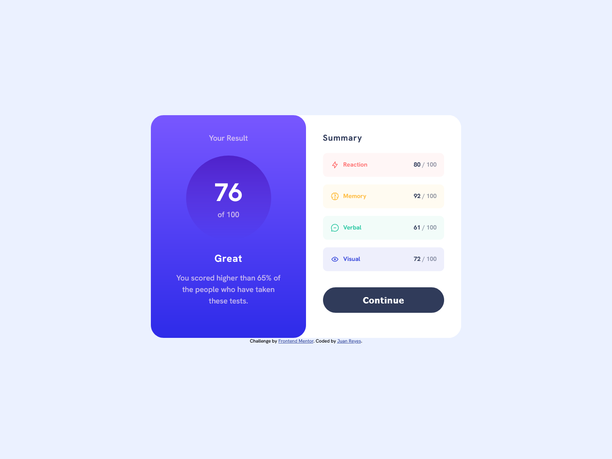

# Frontend Mentor - Results summary component

## Deploying your project

As mentioned above, there are many ways to host your project for free. Our recommended hosts are:

- [GitHub Pages](https://pages.github.com/)
- [Vercel](https://vercel.com/)
- [Netlify](https://www.netlify.com/)

## Got feedback for us?

We love receiving feedback! We're always looking to improve our challenges and our platform. So if you have anything you'd like to mention, please email hi[at]frontendmentor[dot]io.

# Frontend Mentor - Results summary component solution

This is a solution to the [Results summary component challenge on Frontend Mentor](https://www.frontendmentor.io/challenges/results-summary-component-CE_K6s0maV). Frontend Mentor challenges help you improve your coding skills by building realistic projects. 

## Table of contents

- [Overview](#overview)
  - [The challenge](#the-challenge)
  - [Screenshot](#screenshot)
  - [Links](#links)
- [My process](#my-process)
  - [Built with](#built-with)
  - [What I learned](#what-i-learned)
  - [Continued development](#continued-development)
- [Author](#author)

## Overview

- Este desafio, consiste en un componente en el que está dividido en dos partes, una en la que tenemos 
una puntuación final de nuestro producto y otra en la que hay un sumario de puntos favorables con su puntuación sobre 100.

- En cuanto a que los datos los saquemos dinámicamente del archivo json, no se como hacerlo. Por lo que lo dejo para cuando aprenda que se tiene que hacer.

### The challenge

- En la solución he puesto una llamada de consulta de medios a 752px, que es cuando me caben los contenedores (tienen un mínimo espacio a los lados.).

### Screenshot

### Links

- Solution URL: [ubicación de la solución](https://github.com/juan-mentor/results-summary-component-main.git)
- Live Site URL: [lugar en vivo](https://juan-mentor.github.io/sesults-summary-compoent-main/)

## My process

- Una vez descargados los archivos y medido todas los contenedores, márgenes, rellenos y bordes. He empezado por el diseño móvil. En esta parte del desafío no suelo tener problemas, salvo para distinguir colores o sombras.

- Después adapto el diseño escritorio con consultas de medios. En este caso, como la arquitectura era poco compleja, me he decidido por Css grid.

- Seguidamente sigo con los elementos activos de la página y por último me dedico a pensar como debería ser el diseño para dispositivos intermedios ( aquí es donde encuentro mayor dificultad).

### Built with

- Semantic HTML5 markup
- CSS custom properties
- Flexbox
- CSS Grid
- Mobile-first workflow

### What I learned

- Más bien debería decir, que es lo que no he aprendido. Como sería extraer datos de un fichero json
e incorporarlos dinámicamente al HTML.

### Continued development

- Me gustaría saber para que sirven los archivos json y como utilizarlos.

## Author

- Frontend Mentor - [@juan-mentor](https://www.frontendmentor.io/profile/juan-mentor)